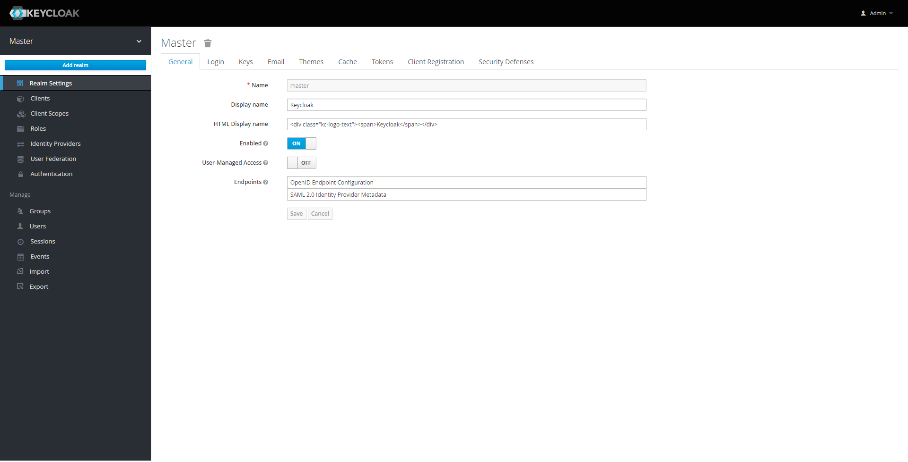
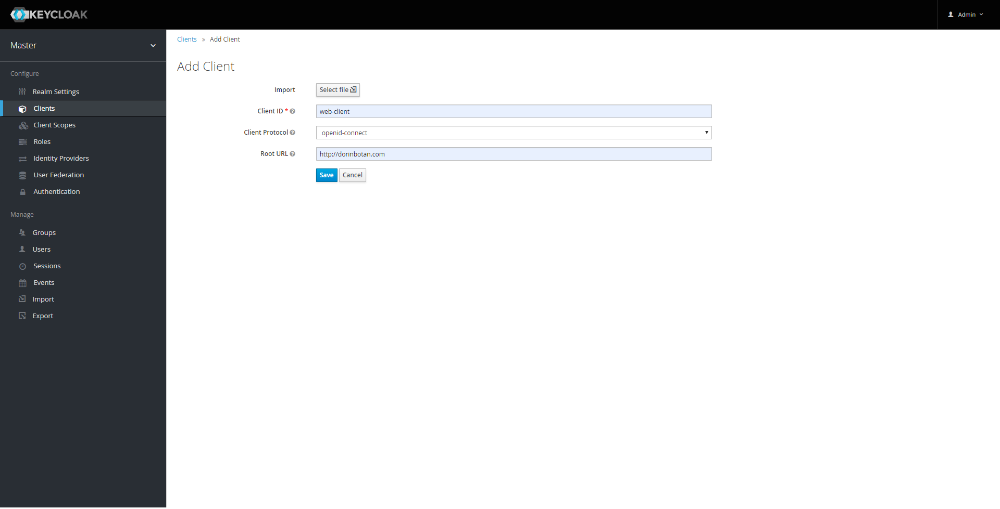
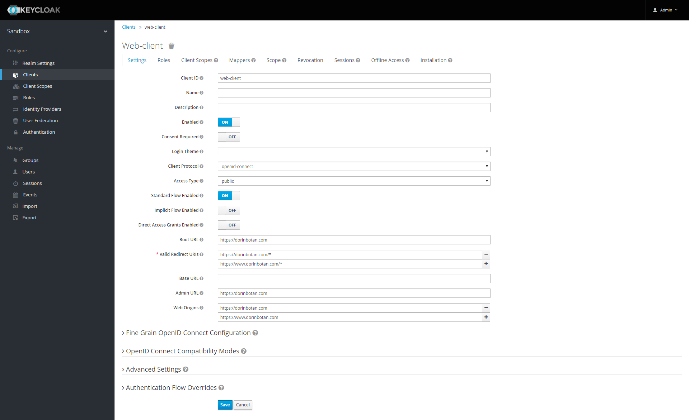
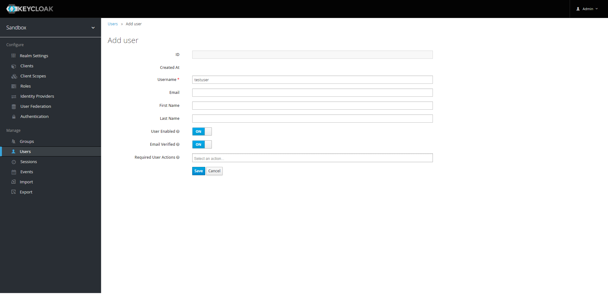
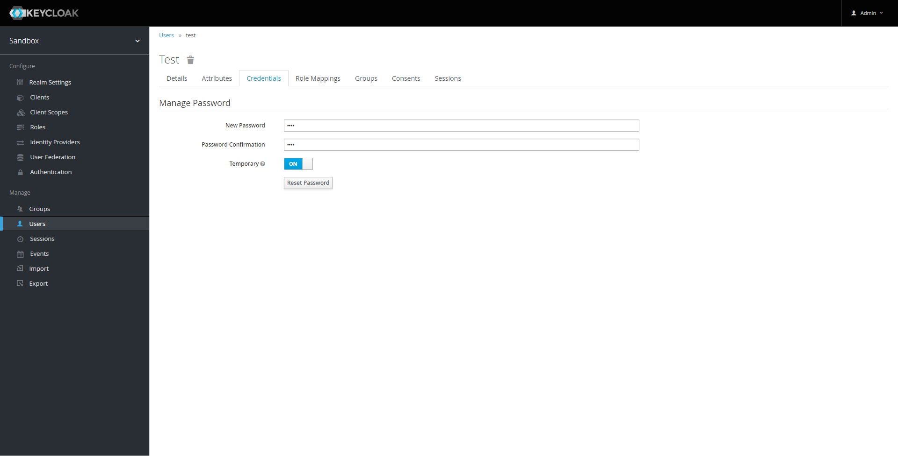

# Keycloak + PostgreSQL + nginx reverse HTTPS proxy + automatic certificate renewal

## Structure

The service consists of 4 Docker containers.

- A **nginx** reverse proxy enabling HTTPS for the Keycloak Server.
- A **Certbot** instance obtaining and renewing nginx certificates from Let's Encrypt.
- A **PostgreSQL** database used by Keycloak to store user accounts. Share/replicate this if Keycloak needs to be scaled.

  Note: An additional Infinispan database is used for caching. It should be shared/replicated as well.
- A **Keycloak** Identity and Access Manager.

## How to

- Run `config.sh` on the target system for initial docker configuration.

  This will:
  - Install Docker
  - Install docker-compose

- Run `init.sh -r <yes|no> -d <domain.com> -e <user@mail.com>` to configure nginx and Certbot.

  This will:
  - Create a **nginx** configuration file to:
    - Serve requests on `/.well-known/acme-challenge/*` port 80 *(required to pass Certbot validation)*
    - Redirect all other requests on port 80 to port 443 *(enforce HTTPS)*
    - Pass all HTTPS request from port 443 to a local HTTP port

  - Generate a valid SSL certificate by:
    - Generating a dummy certificate with openssl *(to start nginx without errors)*
    - Starting nginx
    - Replacing the dummy certificate with a valid Let's Encrypt certificate
    - Reloading nginx

- Set Keycloak admin credentials in `.env` as:

        KEYCLOAK_USER=admin
        KEYCLOAK_PASSWORD=admin
        POSTGRES_USER=admin
        POSTGRES_PASSWORD=admin

- Run `docker-compose up` to start the service.

- **[OPTIONAL]** To run the service on startup, place the following line in `/etc/rc.local`

        (cd /root; docker-compose up)

## Configuration

Currently, configuring the SSO server is only possible via the web interface.

### To do so:

- Log in to the admin console with the credentials given in the `.env` file (admin / admin) by default.
- Create a new Realm by hovering Master realm and pressing Add realm.

- Create a new Client (application requesting user to authorize) by choosing Clients in the left side menu and pressing Create. Client ID will be the name of your client (application) and Root URL will be the URL of your public client (f.ex. https://dorinbotan.com).

- Configure the newly created client. Assuming that you are creating a public web client:

  - Make sure you have Standard Flow Enabled (to enable OAuth2.0 Access Code Grant Flow). Optionally, disable Direct Access Grants if you do not intend to use this client for a server-side app.

  - Add both the www. and not www. URL options to Valid Redirect URIs.

  - Add both the www. and not www. URL options to Web Origins.

  - Don't forget to press Save.

- [OPTIONAL] Create a new User by choosing Users in the left side menu and pressing Add user. Username will be the username used to log the user in. Make sure User Enabled and Email Verified option is enabled (to skip email verification for now). Press Save to create the user.

- Configure the credentials for the newly created user by going into the Credentials tab and typing in the desired password. Press Reset password to confirm.

### NOTE:

- Linux paths are case sensitive while domain names aren't. To avoid errors, always specify the domain name in lowercase when running `./init.sh`.
